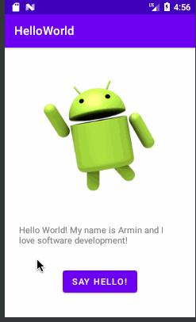

# Pre-work - *Hello World*

**Hello World** is an android app that contains a simple image chosen by the developer and includes a short introduction text with the dev's name and hobbie, as well as a "Say Hello!" button, that once clicked will display a Toast saying "Hello you too!".

Submitted by: **Armin Anton** (Guilherme Armin Da Silva Anton)
Guilheme is the equivalent of William, but in Portuguese.

Time spent: **0.1** hours spent in total

## User Stories

The following **required** functionality is completed:

* [x] User can **see the chosen image** as defined by the dev
* [x] User can **read a short intro** about the dev and its hobbie
* [x] User can **greed and be greeded** by using the "Say Hello!" button

The following **optional** features are implemented:

* [x] Located a button view using findViewById method and its id
* [x] Set a onclick listener to button
* [x] Log defined message about the action performed by the button
* [x] Created an Android Toast with custom message and defined it to appear when the event is triggered

## Video Walkthrough 

Here's a walkthrough of implemented user stories:

GIF created with [LiceCap](http://www.cockos.com/licecap/).

## Notes

Describe any challenges encountered while building the app.

## License

    Copyright 2022 Armin Anton

    Licensed under the Apache License, Version 2.0 (the "License");
    you may not use this file except in compliance with the License.
    You may obtain a copy of the License at

        http://www.apache.org/licenses/LICENSE-2.0

    Unless required by applicable law or agreed to in writing, software
    distributed under the License is distributed on an "AS IS" BASIS,
    WITHOUT WARRANTIES OR CONDITIONS OF ANY KIND, either express or implied.
    See the License for the specific language governing permissions and
    limitations under the License.
